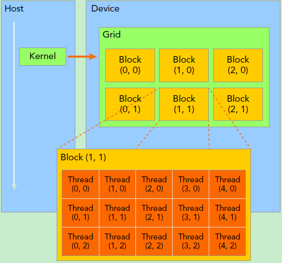
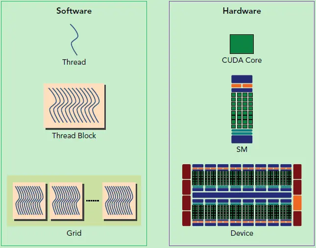

# cuda基本信息

## 一，基本介绍


grid_block_structure

- grid, 一个kernel所启动的所有线程为一个grid，同一个grid共享全局内存空间
- block, block是grid中的一块，grid, block都是dim3的三维大小，上图将z设置为1，方便展示，一个线程块放在同一个SM上
- SM(Stream MultiProcessors): 流式处理器，grid, block是逻辑单元，sm是物理单元，sm可以并发执行数百个线程，一个block的线程放在同一个sm上执行。SM采用的是[SIMT](https://link.zhihu.com/?target=http%3A//docs.nvidia.com/cuda/cuda-c-programming-guide/index.html%23simt-architecture) (Single-Instruction, Multiple-Thread，单指令多线程)架构，基本的执行单元是线程束（warps)，线程束包含32个线程，所以分发到sm到线程块最好是32的倍数，因为sm线程束是基本执行单元。
  
  cuda编程的逻辑层和物理层
  
  cuda内存模型
- 线程块内存，每个线程块有单独内存，grid内共享内存，还有全局内存

## 二，实际展示

看几个型号显卡的属性

- V100

  ```
  Device Name: Tesla V100-SXM2-32GB
  Compute Capability: 7.0
  Total Global Memory: 31 GB
  SM(Stream Multiprocessors)数量: 80
  每个SM最大线程数: 2048
  每个SM最大线程束数量: 64
  每个线程块最大的线程数: 1024
  Max Memory Per Block: 48 KB
  ```
- Orin

  ```
  Device Name: Orin
  Compute Capability: 8.7
  Total Global Memory: 61 GB
  SM(Stream Multiprocessors)数量: 16
  每个SM最大线程数: 1536
  每个SM最大线程束数量: 48
  每个线程块最大的线程数: 1024
  Max Memory Per Block: 48 KB
  ```
- Xavier

  ```
  Device Name: Xavier
  Compute Capability: 7.2
  Total Global Memory: 31 GB
  SM(Stream Multiprocessors)数量: 8
  每个SM最大线程数: 2048
  每个SM最大线程束数量: 64
  每个线程块最大的线程数: 1024
  Max Memory Per Block: 48 KB
  ```

做成表格方便对比

| 设备                                     | V100 | Orin | Xavier |
| ---------------------------------------- | ---- | ---- | ------ |
| **Compute Capability**             | 7.0  | 8.7  | 7.2    |
| **Total Global Memory**            | 31   | 61   | 31     |
| **SM(Stream Multiprocessors)数量** | 80   | 16   | 8      |
| **每个SM最大线程数**               | 2048 | 1536 | 2048   |
| **每个SM最大线程束数量**           | 64   | 48   | 64     |
| **每个线程块最大的线程数**         | 1024 | 1024 | 1024   |
| **Max Memory Per Block**           | 48K  | 48K  | 48K    |
