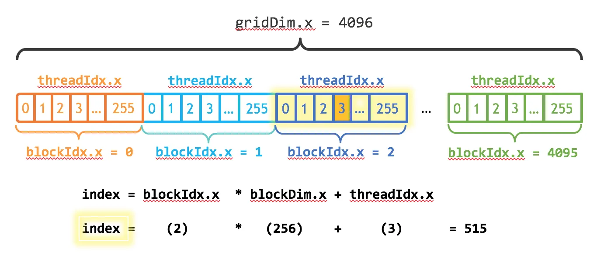
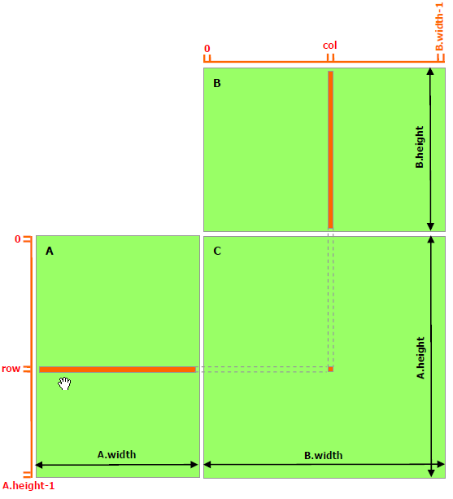

# 如何计算线程索引

调用kernel的时候会传递grid_dim和block_dim进函数，可以理解为每个线程都会执行同样的kernel函数，而kernel函数在执行的时候只是拿到的threadIdx不一样

## 一，grid/block一维

在向量加法例子中，每个线程计算一个求和，grid里设置了256个block，每个block设置了4096个thread

```
    dim3 blockSize(256);
    dim3 gridSize((N + blockSize.x - 1) / blockSize.x);
```

index的索引为 `threadIdx.x +blockIdx.x *blockDim.x,`其中threadIdx为每个线程在block中的第几个位置，blockIdx为block在grid中第几个位置，blockDim为block维度大小，如下图所示，黄色位点点线程索引为515


总结：对于一维<<<grid, block>>>, index=blockIdx.x * blockDim.x + threadIdx.x

在例子文件中，执行cpu程序耗时5.5毫秒，cuda程序的kernel耗时21.056us， 但是cuda上拷贝什么的似乎非常消耗时间

- cpu

  ```
  ++++++++++0.005555
  ```
- gpu

  ```
  ==533887== Profiling application: ./vector_add
  ==533887== Profiling result:
              Type  Time(%)      Time     Calls       Avg       Min       Max  Name
   GPU activities:   51.30%  1.7935ms         1  1.7935ms  1.7935ms  1.7935ms  [CUDA memcpy DtoH]
                     48.10%  1.6818ms         2  840.92us  815.84us  866.01us  [CUDA memcpy HtoD]
                      0.60%  21.056us         1  21.056us  21.056us  21.056us  add(float*, float*, float*, int)
        API calls:   95.46%  132.34ms         3  44.113ms  85.536us  132.15ms  cudaMalloc
                      3.98%  5.5222ms         3  1.8407ms  1.0579ms  3.3798ms  cudaMemcpy
                      0.37%  506.91us         3  168.97us  166.17us  174.12us  cudaFree
                      0.12%  162.43us       101  1.6080us     148ns  65.818us  cuDeviceGetAttribute
                      0.03%  46.605us         1  46.605us  46.605us  46.605us  cuDeviceGetName
                      0.03%  44.549us         1  44.549us  44.549us  44.549us  cudaLaunchKernel
                      0.01%  7.5280us         1  7.5280us  7.5280us  7.5280us  cuDeviceGetPCIBusId
                      0.00%  2.1250us         3     708ns     184ns  1.6010us  cuDeviceGetCount
                      0.00%  1.2510us         2     625ns     211ns  1.0400us  cuDeviceGet
                      0.00%     562ns         1     562ns     562ns     562ns  cuDeviceTotalMem
                      0.00%     268ns         1     268ns     268ns     268ns  cuDeviceGetUuid
  ```

## 二，grid/block二维

grid/block都是二维

计算block在grid的第几个位置: blockIdx.x + blockIdx.y * blockDim.x

计算thread在block的第几个位置：threadIdx.x + threadIdx.y * threadDim.x

index = threadIdx.x + threadIdx.y * threadDim.x + (blockIdx.x + blockIdx.y * blockDim.x)\*(blockDim.x\\*blockDim.y)

计算的时候不一定按照这个逻辑寻址，比如矩阵乘法，让每个线程负责一个输出元素的计算，将线程结构设计和输出矩阵一样大小，对应线程计算对应矩阵输出点，代码见 `matrix_multiply.cu`

```
int row = threadIdx.y + blockIdx.y * blockDim.y;
int col = threadIdx.x + blockIdx.x * blockDim.x;
```

这里的row,col就是线程在grid[row, col]矩阵中的位置，也是输出矩阵C[rot, col]中的位置


输出：`**最大误差: 0**`

看另外一个例子，计算图像均值，每个线程负责一个像素的加法，加法使用atomicAdd,保证不会有两个线程同时操作result这个变量。先在cpu上分配一副一维的图像，初始化后拷贝到gpu，然后创建blockSize为2x2，gridSize为width/2, height/2大小，启动kernel进行原子加法，再把结果拷贝回cpu求均值，得到结果，代码见 `cacul_image_mean.cu`

```
result: 49.5
```

参考：https://zhuanlan.zhihu.com/p/346910129
